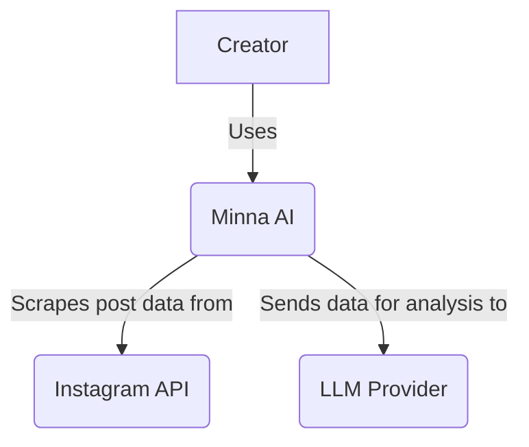

# Minna AI: System Architecture

This document outlines the architecture for the Minna AI application, based on the decisions laid out in the `development-plan.md`.

## 1. System Context Diagram (C4 Model - Level 1)

This diagram shows the high-level context of the Minna AI system, its users, and its interactions with external systems.



*   **Creator:** The end-user of the application. They interact with Minna AI to analyze their social media engagement.
*   **Minna AI:** The system being built. It provides the user interface, orchestrates data scraping, and performs analysis.
*   **Instagram API:** An external dependency used to fetch post data, comments, and user metadata.
*   **LLM Provider (e.g., OpenAI, Gemini):** An external service used to perform the AI-powered analysis of the scraped data.

## 2. Container Diagram (C4 Model - Level 2)

This diagram breaks down the Minna AI system into its deployable/runnable containers.

```mermaid
graph TD
    subgraph "Minna AI System"
        A[Frontend: Next.js App] -->|Makes API calls using HTTPS| B[Backend: FastAPI App]
        B -->|Reads/Writes data to| C[Database: MongoDB Atlas]
    end

    D[Creator's Browser] -->|Visits| A
    B -->|Sends requests to| E(Instagram API)
    B -->|Sends requests to| F(LLM Provider)```

*   **Frontend (Next.js App):** A single-page application running in the user's browser. It's responsible for the user interface and for making API calls to the backend.
*   **Backend (FastAPI App):** The server-side application that handles business logic, interacts with the database, and communicates with external APIs.
*   **Database (MongoDB Atlas):** The primary data store for the application, hosted on MongoDB Atlas.

## 3. Component Diagram (C4 Model - Level 3 - Backend)

This diagram shows the major components within the backend and their interactions. This illustrates the "modular monolith" architecture.

```mermaid
graph TD
    subgraph "Backend (FastAPI App)"
        A[API Endpoints] --> B[User Module]
        A --> C[Instagram Module]
        A --> D[Analysis Module]

        B --> E[Data Access Module]
        C --> E
        D --> E

        C -->|Uses| F(Instagram API Client)
        D -->|Uses| G(LLM Provider Client)
    end
```

*   **API Endpoints:** The interface for the frontend, handling incoming HTTP requests and routing them to the appropriate module.
*   **User Module:** Responsible for user authentication, registration, and profile management.
*   **Instagram Module:** Handles the logic for scraping data from the Instagram API.
*   **Analysis Module:** Orchestrates the analysis of scraped data by preparing it and sending it to the LLM provider.
*   **Data Access Module:** A shared component that provides a standardized way to interact with the database (Repository Pattern).
*   **Instagram API Client / LLM Provider Client:** Small clients responsible for the direct communication with the external APIs.

## 4. Data Models

The following are the core data models for the application, which will be stored in MongoDB.

### User
```json
{
  "_id": "ObjectId",
  "email": "string",
  "hashed_password": "string",
  "createdAt": "ISODate"
}
```

### Post
```json
{
  "_id": "ObjectId",
  "userId": "ObjectId", // Foreign key to User
  "instagramPostId": "string",
  "caption": "string",
  "likes": "number",
  "shares": "number",
  "viewCount": "number",
  "scrapedAt": "ISODate"
}
```

### Comment
```json
{
  "_id": "ObjectId",
  "postId": "ObjectId", // Foreign key to Post
  "instagramCommentId": "string",
  "text": "string",
  "author": {
    "username": "string",
    "bio": "string",
    "location": "string"
  },
  "createdAt": "ISODate"
}
```

### Analysis
```json
{
  "_id": "ObjectId",
  "userId": "ObjectId",
  "postIds": ["ObjectId"],
  "summary": "string",
  "topics": [
    { "topic": "string", "count": "number" }
  ],
  "requests": [
    { "request": "string", "count": "number" }
  ],
  "questions": [
    { "question": "string", "count": "number" }
  ],
  "createdAt": "ISODate"
}
```

## 5. Authentication Flow

Authentication will be handled using JSON Web Tokens (JWT).

1.  **Registration:** A user signs up with an email and password. The backend hashes the password and creates a new user in the database.
2.  **Login:** The user logs in with their credentials. The backend verifies the password and, if successful, generates a short-lived JWT access token.
3.  **Authenticated Requests:** The frontend stores the JWT (e.g., in an HttpOnly cookie or local storage) and includes it in the `Authorization` header for all subsequent requests to protected backend endpoints.
4.  **Token Validation:** The backend has middleware that intercepts requests to protected routes, validates the JWT, and extracts the user's identity from it.

This architecture provides a solid foundation for building Minna AI, balancing development speed with a clear and maintainable structure.